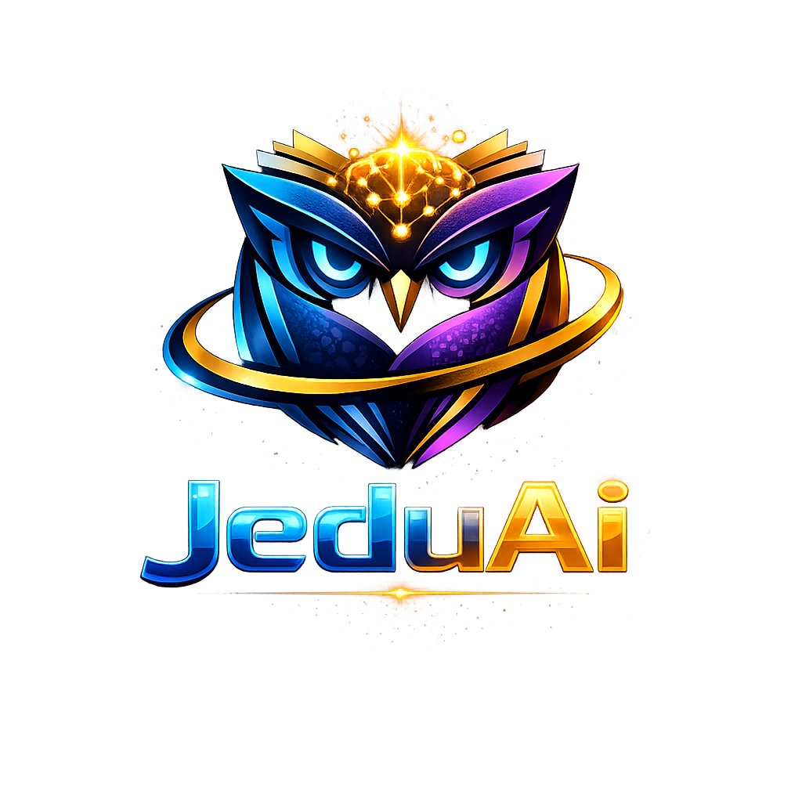

# 🎓 JeduAI - Smart Learning & Assessment Platform

<div align="center">
  
  <br/>
  <br/>
</div>

An AI-powered educational platform built with Flutter, featuring intelligent assessment generation, multi-language support, and real-time AI tutoring for VSB Engineering College.


## 🌟 Features

### 🔐 Authentication & User Management
- **User Registration**: Sign up with email, password, and role selection
- **Secure Login**: Firebase Authentication with email/password
- **Role-Based Access**: Separate portals for Students, Staff, and Admin
- **User Profiles**: Stored in Firestore with real-time sync
- **Password Reset**: (Coming soon)

### 🤖 AI-Powered Features
- **AI Assessment Generator**: Automatically creates quizzes with questions, options, and explanations using Gemini 2.5 Flash
- **AI Tutor**: Real-time conversational learning assistant with multi-language support
- **Smart Translation**: 100+ language support for all content (Admin, Staff, Student portals)
- **Video Translation**: Real-time video translation with AI-generated subtitles (20+ languages)
  - Malayalam ↔ English, Hindi ↔ Kannada, Tamil ↔ Hindi, etc.
  - Three modes: Basic, Advanced AI (Gemini), Full Pipeline (Whisper + NLLB)
  - Voice-over generation with Text-to-Speech
- **Intelligent Recommendations**: Personalized learning paths

### 👨‍🎓 Student Portal
- Dashboard with progress tracking
- AI-generated assessments (class-specific)
- Interactive learning modules
- Video player with controls and subtitles
- **Media Translation**: Upload videos/audio and translate to any language
- Content reader with translation
- Assessment history and scores
- Multi-language content translation (All UI elements)
- AI Tutor chat in any language

### 👨‍🏫 Staff Portal
- Assessment creation (manual & AI-generated)
- Student progress monitoring
- Class-based assessment management
- Real-time assessment preview
- Assessment analytics
- Export assessment data
- Multi-language interface support
- Translation tools for educational content

### 👨‍💼 Admin Portal
- Full platform oversight
- User management
- System analytics
- Platform configuration
- Multi-language admin interface
- Translation management

### 🎥 Video Translation Features
- **Upload & Translate**: Upload any video and translate to 20+ languages
- **Real-time Processing**: AI-powered transcription and translation
- **Subtitle Generation**: Automatic subtitle creation with timing
- **Voice-over**: Text-to-Speech in target language
- **Supported Languages**: English, Hindi, Tamil, Telugu, Kannada, Malayalam, Bengali, Marathi, Gujarati, Punjabi, Urdu, Spanish, French, German, Chinese, Japanese, Korean, Arabic, Portuguese, Russian

## 📥 Download APK

### Latest Release
Download the Android APK and install on your device:

**[📱 Download JeduAI APK (v1.0.2) - Direct Download](https://drive.google.com/uc?export=download&id=1HthWUYS96OI2fh8-SLpyDQl20pb59Ltc)**

**Alternative:** [Open in Google Drive](https://drive.google.com/file/d/1HthWUYS96OI2fh8-SLpyDQl20pb59Ltc/view?usp=sharing) (tap 3 dots → Download)

> **📱 Mobile Tip**: If the link shows a preview, tap the **3 dots menu (⋮)** → **"Download"**

### What's New in v1.0.2 🚀
✅ **Firebase Cloud Integration** - Multi-device sync across all platforms  
✅ **Real-time Notifications** - Instant updates across all devices  
✅ **Custom JeduAi App Icon** - Professional branding (no more Flutter logo)  
✅ **YouTube Video Integration** - Educational courses with configurable URLs  
✅ **Secure Admin Protection** - Default admin (admin@vsb.edu / admin123)  
✅ **Cross-device User Sync** - Sign up on one device, access from anywhere  
✅ **Enhanced Staff Portal** - Create assessments, classes, courses with real-time sync  
✅ **Improved Student Portal** - Real-time notifications for new content  
✅ **Admin Dashboard** - View all users from any device instantly  
✅ **Auto-update System** - Seamless app updates  
✅ **Multi-platform Support** - Android, Web, iOS ready for production  

### Installation Instructions
1. Download the APK file (60.2 MB)
2. On your Android device, go to Settings → Security
3. Enable "Install from Unknown Sources" or "Install Unknown Apps"
4. Open the downloaded APK file
5. Tap "Install" and wait for installation to complete
6. Launch JeduAI app
7. Login with demo credentials (see below)

### Build from Source
```bash
git clone https://github.com/kathirvel-p22/JeduAi.git
cd JeduAi/jeduai_app1
flutter pub get
flutter build apk --release
```
APK will be at: `build/app/outputs/flutter-apk/app-release.apk`

## 🚀 Quick Start

### Prerequisites
- Flutter SDK 3.0 or higher
- Dart SDK 3.0 or higher
- A code editor (VS Code, Android Studio, or IntelliJ)

### Installation

1. **Clone the repository**
```bash
git clone https://github.com/kathirvel-p22/JeduAi.git
cd JeduAi/jeduai_app1
```

2. **Install dependencies**
```bash
flutter pub get
```

3. **Run the app**
```bash
# For web
flutter run -d chrome

# For mobile
flutter run
```

## 🔑 Demo Credentials

### Demo Credentials (Production Ready)

### Default Admin (Auto-created)
- **Email**: `admin@vsb.edu` | **Password**: `admin123`
- **Note**: This admin is automatically created on first app launch

### For New Users
- **Students & Staff**: Can sign up with any email and create their own accounts
- **Real-time Sync**: All user data syncs across devices via Firebase Cloud
- **Multi-device Access**: Sign up on one device, login from anywhere

### Legacy Demo Accounts (Fallback)
If Firebase is not configured, these demo accounts work:

### Students
- **Email**: `kathirvel@gmail.com` | **Password**: Any password
- **Email**: `student@jeduai.com` | **Password**: Any password (Full access)

### Staff
- **Email**: `vijayakumar@vsb.edu` | **Password**: Any password
- **Email**: `shyamaladevi@vsb.edu` | **Password**: Any password
- **Email**: `balasubramani@vsb.edu` | **Password**: Any password
- **Email**: `arunjunaikarthick@vsb.edu` | **Password**: Any password
- **Email**: `manonmani@vsb.edu` | **Password**: Any password

### Admin
- **Email**: `admin@vsb.edu` | **Password**: Any password

## 📊 Platform Statistics

- **Total Users**: 8
- **Students**: 2
- **Staff**: 5
- **Admins**: 1
- **Departments**: Computer Science and Business Systems
- **Subjects**: 5 (Data Science, IoT, Big Data, Cloud Computing, Management)
- **AI Models**: Gemini 2.5 Flash
- **Languages Supported**: 100+

## 🏗️ Project Structure

```
jeduai_app1/
├── lib/
│   ├── config/              # Configuration files (API keys, etc.)
│   ├── controllers/         # State management controllers
│   ├── models/              # Data models
│   ├── routes/              # App routing
│   ├── services/            # Business logic & API services
│   │   ├── ai_assessment_generator_service.dart
│   │   ├── enhanced_ai_tutor_service.dart
│   │   ├── gemini_translation_service.dart
│   │   ├── shared_assessment_service.dart
│   │   └── user_data_service.dart
│   ├── views/               # UI screens
│   │   ├── auth/           # Login screens
│   │   ├── student/        # Student portal
│   │   ├── staff/          # Staff portal
│   │   └── common/         # Shared components
│   └── main.dart           # App entry point
├── assets/                  # Images, fonts, etc.
├── test/                    # Unit tests
├── web/                     # Web-specific files
└── pubspec.yaml            # Dependencies
```

## 🔧 Configuration

### Firebase Setup (Required for Authentication)
The app uses Firebase for real-time authentication and user management. Follow these steps:

1. Create a Firebase project at [Firebase Console](https://console.firebase.google.com/)
2. Enable Email/Password authentication
3. Set up Firestore Database
4. Run FlutterFire CLI to configure:
```bash
dart pub global activate flutterfire_cli
flutterfire configure
```

For detailed instructions, see [FIREBASE_SETUP_GUIDE.md](FIREBASE_SETUP_GUIDE.md)

### Gemini API Setup
1. Get your API key from [Google AI Studio](https://makersuite.google.com/app/apikey)
2. Update `lib/config/gemini_config.dart`:
```dart
static const String apiKey = 'YOUR_API_KEY_HERE';
```

### Firebase Setup (Optional)
1. Create a Firebase project
2. Update `lib/config/firebase_config.dart` with your credentials

### Supabase Setup (Optional)
1. Create a Supabase project
2. Update `lib/config/supabase_config.dart` with your credentials

## 📱 Supported Platforms

- ✅ Web (Chrome, Firefox, Safari, Edge)
- ✅ Android
- ✅ iOS
- ✅ Windows
- ✅ macOS
- ✅ Linux

## 🎯 Key Technologies

- **Frontend**: Flutter & Dart
- **AI**: Google Gemini 2.5 Flash
- **Translation**: Gemini AI, Whisper STT, NLLB-200, Piper TTS
- **State Management**: GetX
- **Local Storage**: SharedPreferences
- **HTTP Client**: http package
- **UI Components**: Material Design 3
- **Video Processing**: video_player, flutter_tts

## 📚 Documentation

- [Platform Users & Features](PLATFORM_USERS_AND_FEATURES.md)
- [VSB College User System](VSB_COLLEGE_USER_SYSTEM.md)
- [AI Assessment Generator](AI_ASSESSMENT_GENERATOR_COMPLETE.md)
- [Shared Assessment System](SHARED_ASSESSMENT_SYSTEM.md)
- [Complete System Summary](COMPLETE_SYSTEM_SUMMARY.md)
- [Video Translation Guide](REAL_TIME_VIDEO_TRANSLATION_GUIDE.md)
- [Media Translation Feature](MEDIA_TRANSLATION_FEATURE.md)

## 🌐 Translation Features

### UI Translation (All Portals)
All user interfaces support 100+ languages:
- **Admin Portal**: Complete translation of all admin features
- **Staff Portal**: All staff tools and interfaces
- **Student Portal**: Full student experience in any language
- **AI Tutor**: Chat in your preferred language
- **Assessments**: Questions and answers in multiple languages

### Video/Audio Translation
Upload any video or audio file and translate:
1. **Upload**: Select video/audio file (MP4, AVI, MOV, MP3, WAV, etc.)
2. **Select Languages**: Choose source and target language
3. **Translation Mode**:
   - **Basic**: Quick translation with predefined content
   - **Advanced AI**: Real Gemini AI translation based on video content
   - **Full Pipeline**: Whisper STT → NLLB Translation → Piper TTS
4. **Output**: Translated video with subtitles and voice-over

### Supported Languages
English, Hindi, Tamil, Telugu, Kannada, Malayalam, Bengali, Marathi, Gujarati, Punjabi, Urdu, Spanish, French, German, Chinese, Japanese, Korean, Arabic, Portuguese, Russian, and 80+ more

## 🤝 Contributing

Contributions are welcome! Please feel free to submit a Pull Request.

1. Fork the repository
2. Create your feature branch (`git checkout -b feature/AmazingFeature`)
3. Commit your changes (`git commit -m 'Add some AmazingFeature'`)
4. Push to the branch (`git push origin feature/AmazingFeature`)
5. Open a Pull Request

## 📄 License

This project is licensed under the MIT License - see the [LICENSE](LICENSE) file for details.

## 👨‍💻 Author

**Kathirvel P**
- GitHub: [@kathirvel-p22](https://github.com/kathirvel-p22)

## 🙏 Acknowledgments

- VSB Engineering College
- Google Gemini AI Team
- Flutter Community
- All contributors and testers

## 📞 Support

For support, email kathirvel@gmail.com or create an issue in this repository.

---

**Made with ❤️ for VSB Engineering College - III CSBS**

---

## 📱 Download JeduAI App

### Android APK Download

**[⬇️ Click Here to Download JeduAI APK (v1.0.2)](https://drive.google.com/uc?export=download&id=1HthWUYS96OI2fh8-SLpyDQl20pb59Ltc)**

**Alternative Link (if above doesn't work):** [Open in Google Drive](https://drive.google.com/file/d/1HthWUYS96OI2fh8-SLpyDQl20pb59Ltc/view?usp=sharing)

**Size**: 60.2 MB | **Version**: 1.0.2 | **Platform**: Android 5.0+

> **📱 Mobile Users**: If the link opens a preview page, tap the **3 dots menu (⋮)** at top-right → Select **"Download"**

### 📋 Step-by-Step Installation Guide

#### Step 1: Download the APK

**On Android Phone:**
1. Click the **[Download Link](https://drive.google.com/uc?export=download&id=1HthWUYS96OI2fh8-SLpyDQl20pb59Ltc)** above
2. If it opens a preview page instead:
   - Tap the **3 dots menu (⋮)** at the top-right corner
   - Select **"Download"** from the menu
3. Or use the **Alternative Link** and tap the download icon (⬇️)
4. If prompted "Can't scan for viruses", tap **"Download anyway"** (the file is safe)
5. Wait for download to complete (60.2 MB, takes 1-2 minutes depending on your internet speed)
6. You'll see a notification when download is complete

**On PC/Laptop:**
1. Click the download link
2. Click the **"Download"** button (⬇️ icon) at top-right
3. Transfer the APK file to your Android phone via USB or cloud storage

#### Step 2: Enable Installation from Unknown Sources
**For Android 8.0 and above:**
1. Go to **Settings** on your Android device
2. Tap **Apps & notifications** (or **Apps**)
3. Tap **Special app access** (or **Advanced**)
4. Tap **Install unknown apps**
5. Select your **browser** (Chrome, Firefox, etc.)
6. Toggle **"Allow from this source"** to ON

**For Android 7.0 and below:**
1. Go to **Settings**
2. Tap **Security**
3. Toggle **"Unknown sources"** to ON
4. Tap **OK** when prompted

#### Step 3: Install the APK
1. Open your **Downloads** folder or notification panel
2. Tap on **app-release.apk** (JeduAI v1.0.2)
3. Tap **"Install"** button
4. Wait for installation to complete (30-60 seconds)
5. Tap **"Open"** or find the **JeduAI** app icon on your home screen

#### Step 4: Launch and Login
1. Open the **JeduAI** app
2. You'll see the login screen
3. Choose your role and login with demo credentials (see below)
4. Start exploring all features!

#### 🔐 Demo Login Credentials (Production Ready)
**Default Admin (Auto-created on first launch):**
- Email: `admin@vsb.edu`
- Password: `admin123`

**New Users (Recommended):**
- Students & Staff can sign up with any email
- All data syncs across devices via Firebase Cloud
- Real-time notifications work instantly

**Legacy Demo Accounts (Fallback if Firebase not configured):**
**Student Access:**
- Email: `kathirvel@gmail.com`
- Password: Any password (e.g., `123456`)

**Staff Access:**
- Email: `vijayakumar@vsb.edu`
- Password: Any password

**Admin Access:**
- Email: `admin@vsb.edu`
- Password: Any password

#### ⚠️ Troubleshooting
- **"Can't download"**: Try using Chrome browser or download on PC and transfer to phone
- **"App not installed"**: Make sure you enabled "Unknown sources" in Settings
- **"Parse error"**: Re-download the APK, the file may be corrupted
- **App crashes**: Make sure your Android version is 5.0 or higher

### 🎥 Video Tutorial
Watch how to download and install: [Coming Soon]

### 📸 Visual Guide
1. **Google Drive Page** → Click "Download" button (⬇️)
2. **Settings** → Security → Enable "Unknown Sources"
3. **Downloads** → Tap APK file → Tap "Install"
4. **JeduAI App** → Login → Explore Features!

### ✅ All Features Working
- ✅ **Firebase Cloud Integration** - Multi-device sync
- ✅ **Real-time Notifications** - Instant updates across devices
- ✅ **Custom JeduAi App Icon** - Professional branding
- ✅ **AI Tutor** (Multi-language chat)
- ✅ **Text Translation** (100+ languages)
- ✅ **Video Translation** (20+ languages)
- ✅ **AI Assessment Generator** with Gemini AI
- ✅ **YouTube Course Integration** - Educational videos
- ✅ **All Portals** (Admin, Staff, Student) with real-time sync
- ✅ **Auto-update System** - Seamless version updates
- ✅ **Cross-platform** - Android, Web, iOS ready

### 🔥 Production Ready Features
- **Multi-device Deployment**: Deploy on Google Play Store and web hosting
- **Real-time Database**: Firebase Firestore with instant sync
- **Secure Authentication**: Firebase Auth with role-based access
- **Admin Protection**: Only existing admins can create new admin accounts
- **Scalable Architecture**: Supports unlimited users across devices
- **Professional UI**: Custom app icon and branding

### Build from Source
```bash
git clone https://github.com/kathirvel-p22/JeduAi.git
cd JeduAi/jeduai_app1
flutter pub get
flutter build apk --release
# APK will be at: build/app/outputs/flutter-apk/app-release.apk
```
